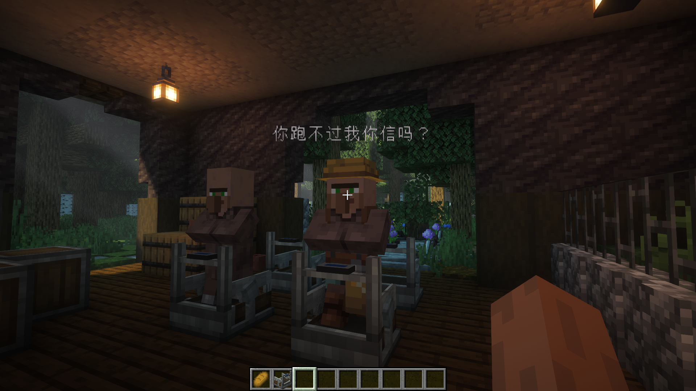
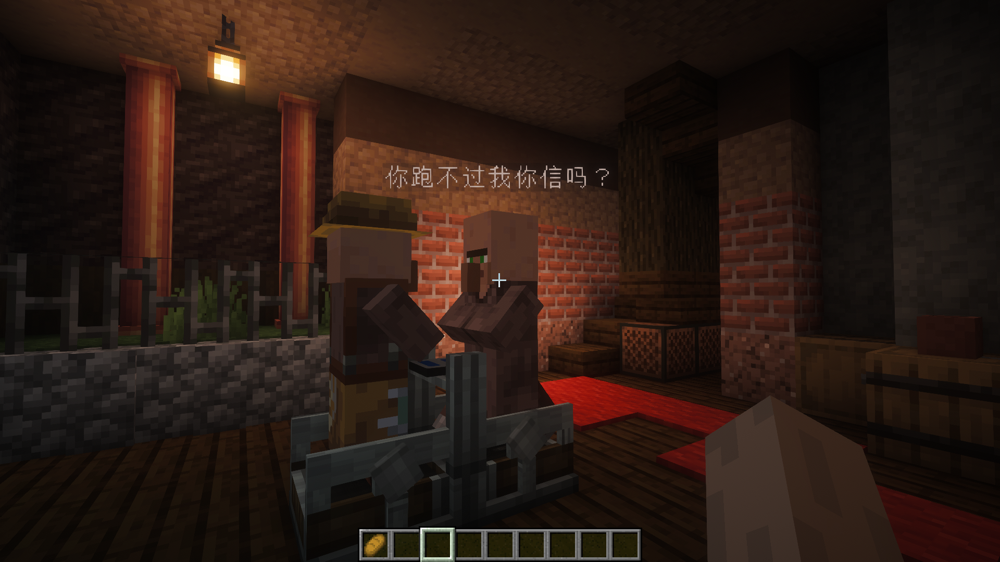
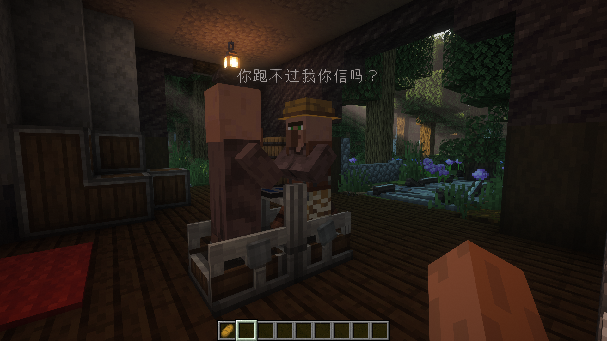

# VHM（村民快乐机）

VHM 是一个基于 NeoForge 与 Create 的 Minecraft 1.21.1 模组，核心内容是一台可被玩家或村民驱动的跑步机

## 更新日志（V1.1.0）
- 新增三件物品：`sprite_sip`、`choco_liz`、`cleansing_brush`
- 新增村民加速效果：`sprite_sip`、`choco_liz`
- 一键清除村民效果：`cleansing_brush`

## 功能
- 玩家上机后可按 `W` 发电，冲刺可提升输出
- 村民可自动上机运行，面包与僵尸都会影响输出倍率
- 支持工程师眼镜查看应力状态
- 支持 Create 的应力网络
- 自定义创造模式分类：`机械动力:你跑不过我你信吗`

### 局内效果





## 安装

1. 安装 Minecraft `1.21.1`
2. 安装 NeoForge `21.1.x`
3. 安装 Create `6.0.10`
4. 将本模组 jar 放入 `mods` 文件夹

## 运行项目

### 环境配置
```bash
# 克隆仓库
git clone https://github.com/yourusername/VHM.git
cd VHM

# 构建项目
./gradlew build

# 运行客户端测试
./gradlew runClient

# 运行服务端测试
./gradlew runServer
```
请确保目录包含libs依赖用于构建
```
—— libs
  |—— compile
       |—— flywheel-neoforge-1.21.1-1.0.6.jar
       |—— ponder-neoforge-1.0.82+mc1.21.1.jar
  |—— create-1.21.1-6.0.10.jar
  
```  
## 玩法

- 直接右键跑步机即可上机
- 按住 `W` 开始发电
- 冲刺可以提高输出
- `Shift` 可下机
- 给村民喂面包可以提高输出
- 村民周围有僵尸时也会提高输出
- `sprite_sip`：玩家饮用后获得迅捷，并有概率清除负面效果；喂给跑步机上的村民可提供高档加速时间
- `choco_liz`：玩家食用后获得伤害免疫与生命恢复，并有概率触发减速效果；喂给跑步机上的村民可提供高档加速时间
- `cleansing_brush`：可清除村民身上的所有效果，包括本模组的加速效果

## 合成配方

跑步机采用竖向合成：
传动轴+安山机壳+传送带
- `create:shaft`
- `create:andesite_casing`
- `create:belt_connector`

## 挖掘与掉落

- 跑步机可被斧头和镐子快速挖掘
- 破坏后会掉落自身

## 创造模式分类

- 分类名：`机械动力:你跑不过我你信吗`
- 图标：跑步机 3D 物品图标
- 分类内包含跑步机、`sprite_sip`、`choco_liz`、`cleansing_brush`

## 资源说明

- 跑步机支持工程师眼镜的应力提示
- 跑步机接入 Create 的机械动力网络
- 跑步机相关数值仍可能继续调优

## 开发信息

- 模组 ID：`vhm`
- 适用版本：Minecraft `1.21.1`
- Loader：NeoForge `21.1.x`
- Create：`6.0.10`

## 联系

- **作者**：Mengy
- **项目主页**：[GitHub Repository](https://github.com/MengyVn/VHM) | [Gitee Repository](https://gitee.com/xiaozhang-code-farmer/vhm.git)
- **问题反馈**：[GitHub Issues](https://github.com/MengyVn/VHM/issues) | [Gitee Issues](https://gitee.com/xiaozhang-code-farmer/vhm/issues)